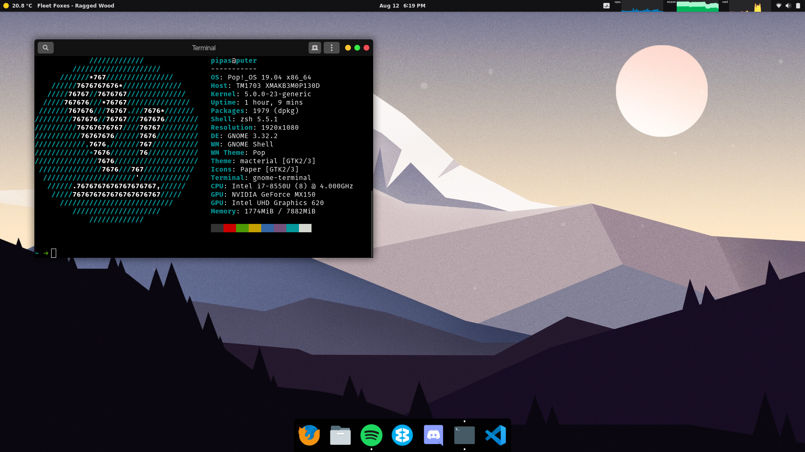
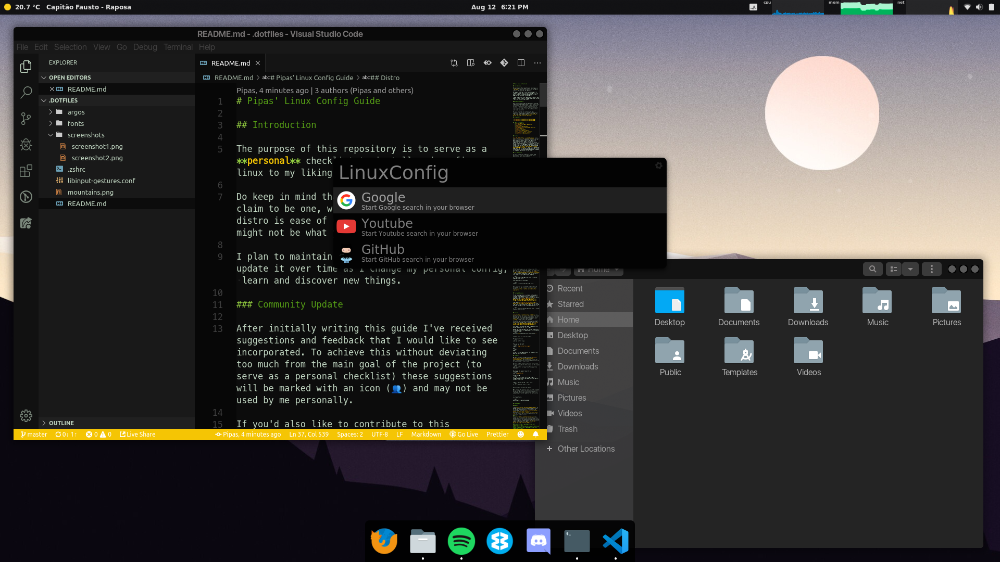

# Pipas' Linux Config Guide

## Introduction

The purpose of this repository is to serve as a **personal** checklist to install and configure linux to my liking as fast possible.

Do keep in mind that I'm not a Linux expert or claim to be one, what I'm most looking for in a distro is ease of use and maintainability so it might not be what you're looking for.

I plan to maintain this repository for myself and update it over time as I change my personal config, learn and discover new things.

### Community Update

After initially writing this guide I've received suggestions and feedback that I would like to see incorporated. To achieve this without deviating too much from the main goal of the project (to serve as a personal checklist) these suggestions will be marked with an icon (👥) and may not be used by me personally.

If you'd also like to contribute to this repository in any way or suggest something feel free to do so by submitting an [issue](https://github.com/Pipas/LinuxConfig/issues).

## Screenshots




## Table of Contents
  - [Distro](#distro)
  - [Pre-requisites](#pre-requisites)
  - [Look](#look)
  - [Extensions](#extensions)
  - [Touchpad Gestures](#touchpad-gestures)
  - [Albert](#albert)
  - [Terminal](#terminal)
  - [Development](#development)
  - [Other Software](#other-software)
  - [Snap Software](#snap-software)
  - [Contributors](#contributors)

## Distro

[Pop!_OS 19.04](https://system76.com/pop) is my distro of choice, it's based on Ubuntu so you get good support from most mainstream apps (like Spotify and Discord) aswell as the Ubuntu community, but it's lighter, faster and just a better experience overall. It also has an ISO with nvidea drivers pre packaged so you don't have to install them yourself and you can take advantage of Ubuntu [PPAs](https://en.wikipedia.org/wiki/Ubuntu#Package_Archives). I found it to be a great experience out of the box even without the further customizations explained ahead and would recommend it to anyone wanting to try out Linux.

## Pre-requisites

To start, clone this repository in your home directory (I clone it to a dot folder so it doesn't show up in file managers)

```shell
git clone https://github.com/Pipas/LinuxConfig .dotfiles
```

## Look

I use Gnome as my desktop environment, it comes built in with new versions of Ubuntu and I found it to work best for me.

A great piece of software to aid your customization of gnome is `Gnome Tweak Tool`

```shell
sudo apt install gnome-tweak-tool
```

Another helper to faster install themes from the [gnome-look.org](gnome-look.org) is [`OCS-url`](https://www.pling.com/p/1136805/).

Here are the themes that I use.

### Gnome and Shell theme 
 - [Macterial](https://www.gnome-look.org/p/1248255/) by MYHTIO

### Icon theme
- [Paper](https://snwh.org/paper) by Sam Hewitt

### Cursor theme
- [Bibata](https://www.gnome-look.org/p/1197198/) by KaizIqbal

### Fonts

The fonts I use for my distro can be found in a fonts folder in this repo. To use them copy them to .fonts
```shell
mkdir ~/.fonts
cp ~/.dotfiles/fonts/* ~/.fonts
```

To set them use the Tweak Tool, here are the values I use:

- Interface Text - **SFNS Display Bold** 12
- Document Text - **SFNS Display Regular** 12
- Monospace Text - **SF Mono Regular** 13
- Legacy Window Titles - **SFNS Display Bold** 12

## Extensions

There are several Gnome extensions that make the experience much better and tweak the system to your liking. There are many to choose from at [extensions.gnome.org](https://extensions.gnome.org/) and here are some of the ones I use.

- #### [User Themes](https://extensions.gnome.org/extension/19/user-themes/) - **needed to change the default shell theme**, as stated in all the comments should be enabled by default.

- #### [Dash to Dock](https://extensions.gnome.org/extension/307/dash-to-dock/) - changes the gnome bar to a dock, highly customizable.

- #### [Argos](https://extensions.gnome.org/extension/1176/argos/) - loads Gnome extensions, used to display spotify current track on top bar.

- #### [Alternate Tab](https://extensions.gnome.org/extension/15/alternatetab/) - Changes the alt-tab menu to show window previews and all windows seperate.

- #### [OpenWeather](https://extensions.gnome.org/extension/750/openweather/) - weather indicator on your top bar, useful to have at times, highly customizable.

- #### [system-monitor](https://extensions.gnome.org/extension/120/system-monitor/) - displays system information in the top bar such as cpu, mem and network.

- #### [Remove App Menu](https://extensions.gnome.org/extension/591/remove-app-menu/) - Removes app menu from top bar to reduce clutter.

- #### [Hide Activities Button](https://extensions.gnome.org/extension/744/hide-activities-button/) - hides the activities button.

- #### [GS Connect](https://extensions.gnome.org/extension/1319/gsconnect/) - connects with KDE Connect. [👥](https://github.com/Pipas/LinuxConfig/pull/3)

### Spotify Display
On the folder argos you can find a script that adds your currently playing song to the Gnome top bar. To install it after installing the [Argos](https://extensions.gnome.org/extension/1176/argos/) extension described above, copy the contents of this folder to the argos config location

```shell
cp ~/.dotfiles/argos/mpris.6l.1s.sh ~/.config/argos/mpris.6l.1s.sh
```
then make the file executable

```shell
chmod +x ~/.config/argos/mpris.6l.1s.sh
```

This extension was created by giedriusStan and tweaked by me, the original repository can be found [here](https://github.com/giedriusStan/argos-mpris).


## Touchpad Gestures

If you're using Linux in a laptop with a modern touchpad enabling gestures is a no brainer to increase productivity, I have achieved this with a program called [libinput-gestures](https://github.com/bulletmark/libinput-gestures) [👥](https://github.com/Pipas/LinuxConfig/pull/3).

They have [installation instructions](https://github.com/bulletmark/libinput-gestures) on their repo, after the instalation is done you can use my personal config file by creating a symlink to it 

```shell
ln -s ~/.dotfiles/libinput-gestures.conf ~/.config/libinput-gestures.conf
```

## Albert

[Albert](https://albertlauncher.github.io/) is a desktop launcher for linux, it's simple, fast and it helps you get to what you want faster. I use Albert quite a lot and I have it bound to the *windows* (super) key on my keyboard.

To do this we first start with installing Albert, instructions on how to do it can be found [here](https://software.opensuse.org/download.html?project=home:manuelschneid3r&package=albert).

After albert is installed, open it and bind the Hotkey combination to `ctrl + Space`.

Now we can bind the super key to that combination so when pressed it'll toggle Albert, first unbind the key in gnome
```shell
gsettings set org.gnome.mutter overlay-key ""
```

and then we'll use xcape to bind it.

First install xcape
```shell
sudo apt install xcape
```

Then you can add both
```shell
xcape -e 'Super_L=Control_L|space'
```
and
```shell
albert
```
to your `Startup Applications` so they both run when you boot the system.

## Terminal

My shell of choice is ZSH with the [Spaceship prompt](https://github.com/denysdovhan/spaceship-prompt). The installation process for this is extremely easy since zplug handles most of it if you use my `.zshrc` file.

First we need to install zsh (we'll also install the powerline and noto fonts needed for the prompt)
```shell
sudo apt install zsh powerline fonts-powerline fonts-noto
```

Now change the default shell to zsh
```shell
chsh -s $(which zsh)
```
Install zplug
```shell
curl -sL --proto-redir -all,https https://raw.githubusercontent.com/zplug/installer/master/installer.zsh | zsh
```

Create a symlink to the `.zshrc` file
```shell
ln -s ~/.dotfiles/.zshrc ~/.zshrc
```

Finally logout to apply the changes.

When opening the terminal again you'll be prompted if you want to install missing plugins just press Y and wait. You'll get a pyenv error but I'll explain how to install pyenv in the next section.

___

or alternatively:

```shell
npm install -g spaceship-prompt
```

## Development

### pyenv

I use [pyenv](https://github.com/pyenv/pyenv) to manage python virtual environments and versions for all my python projects, it can easely be installed by using the [pyenv-installer](https://github.com/pyenv/pyenv-installer).
Check the [wiki](https://github.com/pyenv/pyenv/wiki) to install the necessary dependencies for installing python versions.
### nvm 
I use [nvm](https://github.com/nvm-sh/nvm) to manage npm environments and versions for all my npm projects, it can easely be installed by using `curl -o- https://raw.githubusercontent.com/nvm-sh/nvm/v0.34.0/install.sh | bash`. [👥](https://github.com/Pipas/LinuxConfig/pull/3)

### [docker](https://www.digitalocean.com/community/tutorials/how-to-install-and-use-docker-on-ubuntu-18-04) and [docker-compose](https://www.digitalocean.com/community/tutorials/how-to-install-docker-compose-on-ubuntu-18-04) [👥](https://github.com/Pipas/LinuxConfig/pull/3)

### ssh keys
If you are like me and you forget to copy your ssh keys [every](https://help.github.com/en/articles/checking-for-existing-ssh-keys) ...[fucking](https://help.github.com/en/enterprise/2.16/user/articles/generating-a-new-ssh-key-and-adding-it-to-the-ssh-agent) ...[time](https://help.github.com/en/enterprise/2.15/user/articles/adding-a-new-ssh-key-to-your-github-account) follow the links to check/generate/add new ones. [👥](https://github.com/Pipas/LinuxConfig/pull/3)

## Other Software

- #### [TLP](https://linrunner.de/en/tlp/tlp.html) - Linux Advanced Power Management.
- #### [Spotify](https://www.spotify.com/pt/download/linux/) - Spotify client for linux.
- #### [Wavebox](https://wavebox.io/download) - App to access all of online accounts in one like e-mail, slack and calendar.
- #### [Discord](https://discordapp.com/) - Voice chat for *G A M E R S*.
- #### [VLC](https://www.videolan.org/vlc/index.html) - Free and open source cross-platform multimedia player and framework that plays most multimedia files.
- #### [Deluge](https://deluge-torrent.org/) - Lightweight, free and cross-platform BitTorrent client.
- #### [VS Code](https://code.visualstudio.com/) - Open source text editor with strong extension support.
- #### [CherryTree](https://www.giuspen.com/cherrytree/) - A hierarchical note taking application, featuring rich text and syntax highlighting, storing data in a single xml or sqlite file. [👥](https://github.com/Pipas/LinuxConfig/pull/3)
- #### [KeeWeb](https://keeweb.info/) - Free cross-platform password manager compatible with KeePass. [👥](https://github.com/Pipas/LinuxConfig/pull/3)
- #### [Intellij](https://www.jetbrains.com/idea/) - Integrated development environment (IDE) for developing computer software. [👥](https://github.com/Pipas/LinuxConfig/pull/3)


## Contributors
A big thanks to everyone that helped by either suggesting or contributing to this guide, you can find them and their projects here:

- [Afonso Pinto](https://github.com/afonsobspinto)